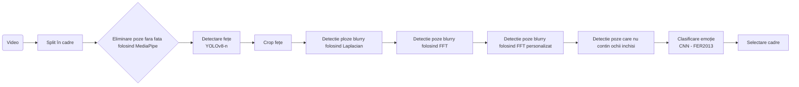

# 🎯 Thumbnail Classifier _Based on People Feelings_

> **TL;DR**: Extrage cadre dintr‑un trailer animat, detectează fețe cu YOLOv8‑n și clasifică expresiile folosind un CNN antrenat pe FER‑2013, astfel încât creatorii de conținut să aleagă în câteva secunde cel mai captivant thumbnail.

---

## 🚀 Motivația Proiectului

- **Public‑țintă:** creatori aflați la început de drum, fără buget pentru design grafic.
- **De ce thumbnail‑ul?** Miniatura este primul contact vizual – decide 70‑90 % din rata de click.
- **Economisire timp & bani:** automatizează extragerea și filtrarea emoțiilor în loc să plătești editări manuale.

> 📊 _Fun fact:_ YouTube raportează că schimbarea thumbnail‑ului poate crește CTR‑ul cu până la **30 %**.

---

## 🧩 Logica Proiectului



---

## 🛠️ Instrumente & Date
| Componentă              | Alegere                 | De ce?                                                                                                                              |
| ----------------------- | ----------------------- | ----------------------------------------------------------------------------------------------------------------------------------- |
| **Video sursă**         | Video animat            | Expresii stilizate ⇒ caz de test greu. Dacă reușește aici, pe fețe reale va merge și mai bine.                                       |
| **Detector fețe**       | `yolov8n.pt`            | 3 M param. ⇒ rulează pe CPU suficient pentru o singură clasă; făcut pentru a elimina falsurile pozitive și pentru a capta fețele.   |
| **Dataset detector**    | **WIDER FACE**          | +30 K imagini, diversitate mare.                                                                                                    |
| **Clasificator emoții** | CNN from scratch        | Simplu și straightforward, antrenare pe **FER-2013**. Dezavantaje: imagini mici, zgomotoase, dar augmentarea + fine-tuning compensează. |


## ⚙️ Implementare

Pentru mai multe detalii tehnice, vizualizati documentatia atasata in `docs/documentation.pdf`.

### Flux operațional end‑to‑end

1) Extrage cadre din video, 1/s
  - Funcția `video_to_frames_one_per_second` din `src/utils/process_frames.py` (folosește Decord + thread pool pentru I/O rapid)
  - Input: video-ul nostru animat
  - Output: `data/test_frames/`

2) Filtrare inițială cadre cu fete (MediaPipe)
  - Funcții: `detect_faces_mediapipe`/`detect_faces` din `src/detection/face_detection_mediapipe.py`
  - Păstrează doar imaginile unde există cel puțin o față
  - Output: `output/test_frames_faces/`

3) Antrenare rapidă folosind YOLOv8 (față)
  - Funcție: `train_yolo_model` din `src/detection/face_detection_yolov8.py`
  - Config: `config/widerface_yolo.yaml` (dataset cu 1 clasă: face)
  - Model de bază: `models/yolov8n.pt`
  - Output: `data/widerface_yolo/yolo_model/weights/best.pt`

4) Re‑detectare fețe cu YOLOv8 și salvare imagini annotate
  - Funcție: `detect_faces_yolo` din `src/detection/face_detection_yolov8.py`
  - Scop: obținere bounding box-uri robuste pt. pașii de calitate
  - Output: `output/test_frames_faces_yolo/` (imagini cu boxuri desenate)

5) Eliminare cadre cu ochi închiși (EAR, MediaPipe Face Mesh)
  - Funcții: `detect_closed_eyes`/`eliminate_closed_eyes` din `src/detection/filter_closed_eyes.py`
  - Output: `output/test_frames_without_closed_eyes/`

6) Eliminare cadre mișcate/blur
  - Fișiere: `motion_detection_laplacian.py`, `motion_detection_laplacian_kernel.py`, `motion_detection_fft.py`
  - Funcția: `eliminate_photos_with_motion` din `src/detection/filter_motion.py`
  - Reguli: păstrat doar dacă NU este blur/motion după ce se verifica cele 3 etape:
    - Varianță Laplacian clasică 
    - Laplacian cu kernel personalizat
    - FFT pe un border definit al fetei (prag ~140, `radius=60`);
  - Output: `output/test_frames_without_motion/`

7) Selectarea persoanei „principale”
  - Funcții: `extract_face_landmarks`, `calculate_landmark_distance`, `detect_most_present_face` din `src/utils/get_main_person.py`
  - Heuristică: compară distanța medie a landmark‑urilor față de primul cadru;
  - Output: `output/final_frames/`

8) Clasificare emoții și triere pe foldere
  - Fișier: `src/predict_emotions.py`
  - Detector fețe: YOLO (modelul antrenat la pasul 3)
  - Clasificator: `models/emotion_recognition.h5` (CNN antrenat pe FER‑2013)
  - Emotii: `['Angry','Disgust','Fear','Happy','Sad','Surprise','Neutral']`
  - Output: copiază imaginile din `output/final_frames/` în `data/emotions/<Emoție>/`

Pipeline-ul complet este prezentat în `src/main.py`.

### Structura fisierelor de output

- `data/test_frames/` – cadre extrase 1/s
- `output/test_frames_faces/` – cadre cu cel puțin o față (MediaPipe)
- `output/test_frames_faces_yolo/` – cadre annotate cu boxuri (YOLO)
- `output/test_frames_without_closed_eyes/` – fără ochi închiși
- `output/test_frames_without_motion/` – fără motion/ motion blur
- `output/final_frames/` – cadre finale
- `data/emotions/<Emoție>/` – triere finală după emoție

### Tehnologii

```text
Python · OpenCV · Ultralytics YOLOv8 · TensorFlow/Keras · Torch · Scikit-learn · Mediapipe · Decord · (MPS/CUDA/CPU)
```

## ✨ Key Technical Achievements:

- Pipeline cu mai multe etape:
  - pre‑filtrare MediaPipe, re‑detecție YOLO, 3 metode de blur/motion (Laplacian, kernel, FFT pe ROI)
  - EAR pentru a evita cadrele cu ochi închiși – util concret pentru thumbnails
- Eficiență I/O: Decord + ThreadPool pentru salvarea cadrelor 1/s foarte rapid
- Modulare clară a codului: `utils/`, `detection/`, `training/` și `predict_emotions.py` separate
- Antrenare YOLO integrată în flow, cu configurare pe setul de date WIDER FACE
- Clasificator emoții CNN cu augmentare, early‑stopping și ReduceLROnPlateau
- Fisiere de output structurate pe emoții – simplifică alegerea rapidă a thumbnail‑urilor


## 🐞 Provocări

- Găsirea unui dataset potrivit
  Avand in vedere ca am decis sa clasific folosind o retea neurala, nu am avut alta varianta decat fer2013, in ciuda dezavantajelor setului de date.
- Performanța clasificatorului
  Clasificatorul in ciuda faptului ca beneficiaza de data augmentation corespunzator pentru setul de date, este destul de slab din cauza lipsei blocurilor multiple si a calitatii setului de date
- Ambiguitatea sentimentelor din cauza lipsei performantei clasificatorului |

---

## 📚 Ce am învățat

- Fine‑tuning YOLO vs. pre‑training from scratch.
- Cum afectează rezoluția setului de date calitatea predicțiilor
